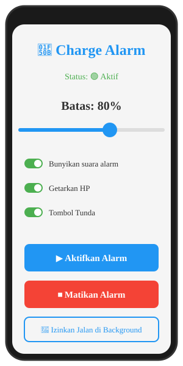
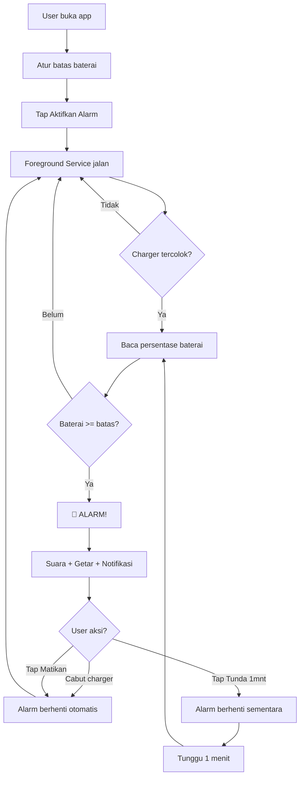

# 🔋 Charge Alarm

> Aplikasi Android sederhana untuk mengingatkanmu mencabut charger saat baterai mencapai batas tertentu (misal 80%). Alarm akan berbunyi, HP bergetar, dan notifikasi muncul.


---

## 📸 Preview Aplikasi

### 🖼️ Mockup UI


```
┌─────────────────────────────────┐
│                                 │
│         🔋 Charge Alarm         │
│                                 │
│      Status: 🟢 Aktif           │
│                                 │
│                                 │
│         Batas: 80%              │
│                                 │
│    ▬▬▬▬▬▬▬▬▬▬▬▬▬●▬▬▬▬▬▬▬▬       │
│    50%          80%        100% │
│                                 │
│   [✓] Bunyikan suara alarm      │
│   [✓] Getarkan HP               │
│   [✓] Tampilkan tombol Tunda    │
│                                 │
│   ┌─────────────────────────┐   │
│   │  ▶️  Aktifkan Alarm     │   │
│   └─────────────────────────┘   │
│                                 │
│   ┌─────────────────────────┐   │
│   │  ⏹️  Matikan Alarm      │   │
│   └─────────────────────────┘   │
│                                 │
│   ┌─────────────────────────┐   │
│   │  🔋 Izinkan Jalan di    │   │
│   │     Background          │   │
│   └─────────────────────────┘   │
│                                 │
│  Alarm berbunyi saat baterai    │
│  mencapai batas. Otomatis       │
│  berhenti saat charger dicabut. │
│                                 │
└─────────────────────────────────┘
```

### 🗣️ Text-to-Speech

Contoh teks default:

> Baterai sudah 80 persen, silakan cabut charger.

Placeholder yang tersedia: `{percent}` untuk persentase saat ini dan `{batas}` untuk target. TTS mengulang setelah kalimat selesai selama alarm masih aktif.

### 🌡️ Temperature Warning

Ambang suhu dapat dipilih dari 35°C sampai 50°C. Saat suhu baterai mencapai ambang, aplikasi menampilkan peringatan temperatur tinggi.

### 📊 Charging Session & Speed

Saat charging dimulai, aplikasi mencatat persentase awal dan waktu mulai. Selama charging, dashboard menghitung laju pengisian dan ETA menuju target. Saat target tercapai, sesi dicatat ke riwayat dengan durasi menuju target.

### 🔔 Notifikasi Alarm (saat baterai mencapai 80%)

```
┌─────────────────────────────────┐
│  🔋 Charge Alarm aktif          │
│  ⚡ Charging • 80% (batas 80%)  │
│              [Matikan]          │
└─────────────────────────────────┘

┌─────────────────────────────────┐
│  🔔 Baterai 80% — Cabut Charger!│
│  Baterai sudah mencapai batas.  │
│  Segera cabut charger.          │
│                                 │
│  [Matikan]  [Tunda 1 mnt]       │
└─────────────────────────────────┘
```

> 📷 **Screenshot asli akan ditambahkan setelah build pertama berhasil.**
> Kalau kamu sudah punya APK, ambil screenshot dan taruh di folder `docs/screenshots/`, lalu ganti mockup ASCII di atas dengan:
> ```markdown
> 
> 
> ```

---

## 🎬 Alur Kerja Aplikasi



---

## ✨ Fitur

- 🔋 **Custom batas baterai** — atur dari 50% sampai 100%
- 🔔 **Alarm suara** — pakai nada alarm default HP (atau custom MP3)
- 📳 **Getaran** — pola getar khusus
- 🔕 **Notifikasi interaktif** — tombol "Matikan" dan "Tunda 1 menit"
- 🔄 **Auto-stop** — alarm berhenti saat charger dicabut
- 🔋 **Auto-start setelah reboot** — service jalan otomatis
- 🌙 **Jalan di background** — pakai Foreground Service
- ⚙️ **Toggle sound/vibrate/snooze** — bisa dinyalakan/dimatikan
- 📊 **Status real-time** — dashboard menampilkan persen baterai, suhu, kecepatan charging, dan ETA
- 🗣️ **Text-to-Speech** — kalimat custom dengan `{percent}` / `{batas}`, diulang sampai alarm dihentikan atau charger dicabut
- 🌡️ **Temperature warning** — ambang suhu baterai dapat diatur 35–50°C
- 📊 **Charging session history** — waktu mulai, target tercapai, dan durasi sesi disimpan lokal
- ⚡ **Charging speed / ETA** — estimasi laju %/jam dan waktu menuju target

---

## 📋 Persyaratan

| Item | Minimum |
|------|---------|
| Android | 8 (API 26) |
| Target SDK | 34 (Android 14) |
| RAM | 2 GB |
| Storage | 10 MB |
| Izin | Notifikasi, Getar, Battery Optimization |

---

## 🚀 Cara Build

### Opsi 1: GitHub Actions (Recommended untuk PC spek rendah)

**Gratis, unlimited untuk public repo, tidak perlu install apa-apa di PC.**

1. **Fork repo ini** ke akun kamu
2. Buka tab **Actions** di repo fork
3. Klik **Build APK** → **Run workflow**
4. Tunggu ~3-5 menit
5. Download APK dari section **Artifacts**

📖 **[Panduan lengkap build via GitHub Actions](BUILD_GUIDE.md)**

### Opsi 2: Android Studio Lokal

```bash
git clone https://github.com/sinargaleri8/charge-alarm.git
cd charge-alarm
./gradlew assembleDebug
```

APK akan ada di: `app/build/outputs/apk/debug/app-debug.apk`

### Opsi 3: Command Line (tanpa Android Studio)

```bash
# Butuh JDK 17 dan Android SDK
export ANDROID_HOME=/path/to/android/sdk
./gradlew assembleDebug
```

---

## 📥 Download APK

### Build terbaru
🔗 **[Download dari Releases](https://github.com/sinargaleri8/charge-alarm/releases)**

### Build dari source
1. Buka tab **Actions**
2. Klik workflow run terbaru (✅ hijau)
3. Scroll ke **Artifacts**
4. Klik **ChargeAlarm-debug-APK**
5. Extract ZIP → dapat `app-debug.apk`

---

## 📱 Cara Pakai

### 1. Install APK
- Transfer `app-debug.apk` ke HP
- Tap APK → **Install**
- Kalau muncul peringatan: aktifkan **"Install from unknown sources"**

### 2. Setup Pertama Kali
- Buka app **Charge Alarm**
- **WAJIB:** Tap **🔋 Izinkan Jalan di Background** → pilih **Allow**
- (Opsional) Matikan optimasi baterai di **Settings → Apps → Charge Alarm → Battery → Unrestricted**

### 3. Atur Batas
- Geser slider ke batas yang diinginkan (misal **80%**)

### 4. Aktifkan
- Tap **▶️ Aktifkan Alarm**
- Charge HP seperti biasa
- Alarm akan berbunyi saat mencapai batas

### 5. Matikan Alarm
- Tap **⏹️ Matikan Alarm** di app, ATAU
- Tap **Matikan** di notifikasi, ATAU
- Cabut charger (alarm berhenti otomatis)

---

## ⚙️ Konfigurasi

| Setting | Default | Deskripsi |
|---------|---------|-----------|
| Batas baterai | 80% | Range 50%-100% |
| Suara alarm | ON | Pakai nada alarm default HP |
| Getar | ON | Pola: 600ms on, 400ms off |
| Tombol Tunda | ON | Snooze 1 menit |

---

## 🔧 Troubleshooting

<details>
<summary><b>❌ Alarm tidak berbunyi saat baterai mencapai batas</b></summary>

**Cek hal berikut:**

1. **Izin notifikasi** sudah diberikan? (Android 13+ butuh POST_NOTIFICATIONS)
2. **Optimasi baterai** sudah dimatikan? Tap tombol "Izinkan Jalan di Background"
3. **Volume alarm** HP tidak 0? (App pakai STREAM_ALARM, bukan media)
4. **Service aktif?** Cek notifikasi "Charge Alarm aktif" muncul di status bar

**Khusus per brand:**

- **Xiaomi/MIUI:** Settings → Apps → Charge Alarm → **Autostart ON**, **Battery saver OFF**
- **Samsung:** Settings → Battery → Background usage limits → hapus dari **Sleeping apps**
- **Oppo/Vivo:** Settings → Battery → App battery management → **Allow background**
- **Huawei:** Settings → Battery → App launch → Manage manually → **semua ON**

</details>

<details>
<summary><b>❌ APK tidak bisa di-install</b></summary>

1. **HP belum izinkan unknown sources** → Settings → Security → Unknown sources ON
2. **APK corrupt** → download ulang
3. **Android version < 8** → aplikasi ini minSdk 26
4. **Play Protect blokir** → tap "Install anyway"

</details>

<details>
<summary><b>❌ Build gagal di GitHub Actions</b></summary>

Cek tab **Actions** → klik workflow yang ❌ → baca error.

Error umum:
- `SDK location not found` → cek `gradle.properties`
- `Unsupported class file major version` → pastikan JDK 17
- `Resource mipmap not found` → cek AndroidManifest.xml

</details>

---

## 🛠️ Teknologi

- **Bahasa:** Kotlin
- **Build:** Gradle 8.5 + AGP 8.2.2
- **Min SDK:** 26 (Android 8)
- **Target SDK:** 34 (Android 14)
- **Arsitektur:**
  - `MainActivity` — UI utama
  - `BatteryMonitorService` — Foreground service pemantau baterai
  - `AlarmActionReceiver` — Handle tombol notifikasi
  - `SnoozeReceiver` — Handle snooze
  - `BootReceiver` — Auto-start setelah reboot

---

## 📂 Struktur Project

```
charge-alarm/
├── .github/workflows/
│   └── build.yml              # GitHub Actions
├── app/
│   ├── build.gradle.kts
│   ├── proguard-rules.pro
│   └── src/main/
│       ├── AndroidManifest.xml
│       ├── java/com/example/chargealarm/
│       │   └── MainActivity.kt    # Semua kode digabung
│       └── res/
│           ├── layout/activity_main.xml
│           ├── values/strings.xml
│           ├── values/themes.xml
│           └── xml/backup_rules.xml
├── gradle.properties
├── settings.gradle.kts
├── build.gradle.kts
└── README.md
```

---

## 🤝 Kontribusi

Pull request selalu welcome! Untuk perubahan besar, buka **issue** dulu untuk diskusi.

1. Fork repo
2. Buat branch fitur (`git checkout -b fitur/AlarmBaru`)
3. Commit (`git commit -m 'Tambah fitur X'`)
4. Push (`git push origin fitur/AlarmBaru`)
5. Buka Pull Request

---

## 📄 Lisensi

MIT License — bebas dipakai, dimodifikasi, dan didistribusikan.

Lihat [LICENSE](LICENSE) untuk detail.

---

## 🙏 Kredit

- Dibuat dengan ❤️ untuk menghemat umur baterai
- Terinspirasi dari [AccuBattery](https://play.google.com/store/apps/details?id=com.digibites.accubattery)

---

## 📞 Kontak

- **GitHub Issues:** [Buka issue](https://github.com/sinargaleri8/charge-alarm/issues)
- **Email:** ahkepolu@hotmail.com

---

<p align="center">
  <b>⭐ Kalau berguna, kasih star ya! ⭐</b>
</p>
